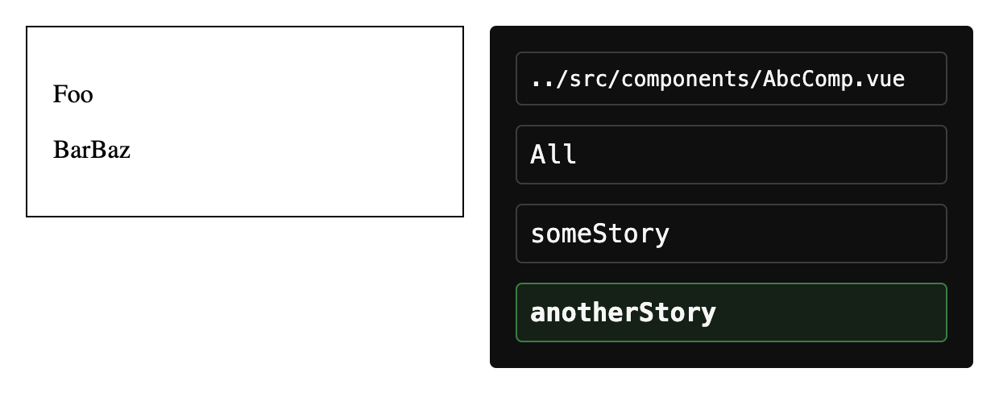

# Vue Isolation

Vue-iso provides you with a playground to develop your vue components in
isolation.

It is inspired by but ships without the overhead of Storybook, is vue-only and
has a developer-first approach.

There is no pretty UI that lets you change your component details from within the
browser directly. Instead, it requires you to write all your stories directly in
your SFC and expose them.

This makes development a lot easier since you never lose your temporary
stories, as there are no, and you never leave your component. You can focus on
development and preview your component stories with HMR.

## Usage

You define stories by exposing a `_stories` object from your SFC. Each key holds
a story, where the key is the story name and the value holds the props and
slots for the story.

```vue
<script lang="ts" setup>
defineProps<{
  someProp?: string
}>()

defineExpose({
  _stories: {
    someStory: {
      props: {
        someProp: "Lorem ipsum",
      },
      slots: {
        someSlot: "Lorem ipsum",
      },
    },
    anotherStory: {
      props: {
        someProp: "Foo",
      },
      slots: {
        default: "Bar",
        someSlot: "Baz",
      },
    },
  },
})
</script>

<template>
  <div class="border p-4">
    <p>{{ someProp }}</p>
    <p>
      <slot />
      <slot name="someSlot" />
    </p>
  </div>
</template>
```

In the GUI you can switch between your stories with a single click or show all
of them.

Import your components from the root of your project like `/src/components/Btn.vue`.



## Installation

```console
pnpm add -D vue-iso
```

## Setup

Create a new page for your isolated playground:

```vue
<script lang="ts" setup>
import { IsolationPage } from "vue-iso"
import "vue-iso/dist/style.css"
</script>

<template>
  <IsolationPage />
</template>
```

In your vue-router routes add a route for your page, you probably only want to
have it inside your dev env.

```ts
const routes: RouteRecordRaw[] = [
  // …
]

const devOnlyRoutes: RouteRecordRaw[] = [
  {
    path: "/iso",
    component: () => import("pages/IsolationPage.vue"),
  },
]

if (import.meta.env.DEV) {
  routes.push(...devOnlyRoutes)
}
```
